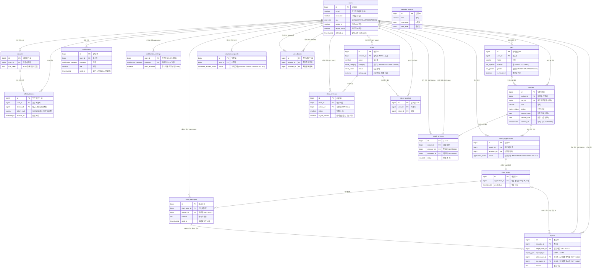

```mermaid
erDiagram
    users {
        bigint id PK "고유 ID"
        varchar email "로그인 이메일 (유일)"
        varchar nickname "닉네임 (유일)"
        user_role role "권한 (USER/VOLUNTEER/ADMIN)"
        varchar region_si "거주 시 (선택)"
        varchar region_dong "거주 동 (선택)"
        timestamptz deleted_at "탈퇴 시각 (soft delete)"
    }
    devices {
        bigint id PK "디바이스 ID"
        bigint user_id FK "소유 사용자"
        text fcm_token "FCM 등록 토큰 (유일)"
    }
    refresh_tokens {
        bigint id PK "토큰 레코드 ID"
        bigint user_id FK "소유 사용자"
        bigint device_id FK "발급 디바이스 (선택)"
        varchar token_hash "SHA-256 해시 (원문 미저장)"
        timestamptz expires_at "만료 시각"
    }
    pets {
        bigint id PK "반려동물 ID"
        bigint user_id FK "보호자"
        varchar name "이름"
        pet_species species "종 (DOG/CAT/OTHER)"
        pet_gender gender "성별 (MALE/FEMALE/UNKNOWN)"
        boolean is_neutered "중성화 여부"
    }
    notifications {
        bigint id PK "알림 ID"
        bigint user_id FK "수신자"
        notification_category category "분류"
        varchar title "제목"
        timestamptz read_at "읽은 시각 (NULL=안읽음)"
    }
    notification_settings {
        bigint user_id PK "사용자 (FK, PK 일부)"
        notification_category category PK "카테고리 (PK 일부)"
        boolean push_enabled "푸시 허용 여부 (기본 true)"
    }
    matches {
        bigint id PK "요청 글 ID"
        bigint author_id FK "작성자 (보호자)"
        bigint pet_id FK "대상 반려동물 (선택)"
        varchar title "제목"
        match_status status "진행 상태"
        date desired_date "희망 날짜 (선택)"
        time desired_time "희망 시간 (선택)"
        timestamptz deleted_at "삭제 시각 (soft delete)"
    }
    match_applications {
        bigint id PK "신청 ID"
        bigint match_id FK "대상 매칭 글"
        bigint applicant_id FK "신청 봉사자"
        application_status status "신청 상태 (PENDING/ACCEPTED/REJECTED)"
    }
    chat_rooms {
        bigint id PK "채팅방 ID"
        bigint application_id FK "대상 신청 (UNIQUE, 1:1)"
        timestamptz created_at "생성 시각"
    }
    chat_messages {
        bigint id PK "메시지 ID"
        bigint chat_room_id FK "소속 채팅방"
        bigint sender_id FK "발신자 (SET NULL)"
        text content "메시지 내용"
        timestamptz read_at "상대방 읽은 시각"
    }
    match_reviews {
        bigint id PK "후기 ID"
        bigint match_id FK "대상 매칭"
        bigint reviewer_id FK "작성자 (SET NULL)"
        bigint reviewee_id FK "대상자 (SET NULL)"
        smallint rating "평점 (1~5)"
    }
    stores {
        bigint id PK "매장 ID"
        bigint created_by FK "등록자 (NULL=시드)"
        varchar name "상호명"
        store_category category "분류 (CAFE/RESTAURANT/PARK)"
        store_status status "노출 상태"
        numeric rating_avg "리뷰 평균 (비정규화)"
    }
    store_reviews {
        bigint id PK "리뷰 ID"
        bigint store_id FK "대상 매장"
        bigint author_id FK "작성자 (SET NULL)"
        smallint rating "평점 (1~5)"
        boolean is_pet_allowed "반려동물 출입 가능 여부"
    }
    store_favorites {
        bigint id PK "즐겨찾기 ID"
        bigint user_id FK "사용자"
        bigint store_id FK "매장"
    }
    volunteer_requests {
        bigint id PK "요청 ID"
        bigint user_id FK "신청자"
        volunteer_request_status status "처리 상태 (PENDING/APPROVED/REJECTED)"
    }
    reports {
        bigint id PK "신고 ID"
        bigint reporter_id FK "신고자"
        bigint target_user_id FK "신고 대상 (SET NULL)"
        report_type report_type "USER / CHAT"
        bigint chat_room_id FK "CHAT 신고: 대상 채팅방 (SET NULL)"
        bigint message_id FK "CHAT 신고: 대상 메시지 (SET NULL)"
        text reason "신고 사유"
    }
    user_blocks {
        bigint id PK "차단 레코드 ID"
        bigint blocker_id FK "차단한 사용자"
        bigint blocked_id FK "차단된 사용자"
    }
    calendar_events {
        bigint id PK "일정 ID"
        varchar title "제목"
        date start_date "시작일"
        date end_date "종료일"
    }

    %% Auth 도메인
    users ||--o{ devices : "디바이스 소유"
    users ||--o{ refresh_tokens : "토큰 발급"
    devices |o--o{ refresh_tokens : "디바이스 연결"
    users ||--o{ pets : "반려동물 등록"
    users ||--o{ volunteer_requests : "봉사자 역할 신청"

    %% Notification 도메인
    users ||--o{ notifications : "알림 수신"
    users ||--o{ notification_settings : "카테고리별 push on/off"

    %% Match 도메인
    users ||--o{ matches : "요청 글 작성"
    pets |o--o{ matches : "이동 지원 대상"
    matches ||--o{ match_applications : "봉사 신청 접수"
    users ||--o{ match_applications : "봉사 신청"
    match_applications ||--|| chat_rooms : "신청당 1:1 채팅방"
    chat_rooms ||--o{ chat_messages : "방 메시지"
    users |o--o{ chat_messages : "메시지 발신 (SET NULL)"
    matches ||--o{ match_reviews : "봉사 후기 대상"
    users |o--o{ match_reviews : "후기 작성 (SET NULL)"
    users |o--o{ match_reviews : "후기 수신 (SET NULL)"

    %% Map 도메인
    users |o--o{ stores : "매장 등록 (SET NULL)"
    stores ||--o{ store_reviews : "매장 리뷰"
    users |o--o{ store_reviews : "리뷰 작성 (SET NULL)"
    users ||--o{ store_favorites : "즐겨찾기 사용자"
    stores ||--o{ store_favorites : "즐겨찾기 매장"

    %% Report / Block 도메인
    users ||--o{ reports : "신고 접수"
    users |o--o{ reports : "신고 대상 (SET NULL)"
    chat_rooms |o--o{ reports : "CHAT 신고: 채팅방 참조"
    chat_messages |o--o{ reports : "CHAT 신고: 메시지 참조"
    users ||--o{ user_blocks : "차단 주체 (blocker)"
    users ||--o{ user_blocks : "차단 대상 (blocked)"
```
