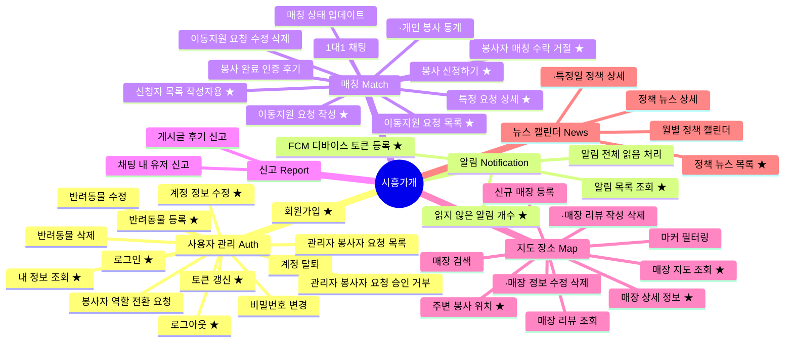
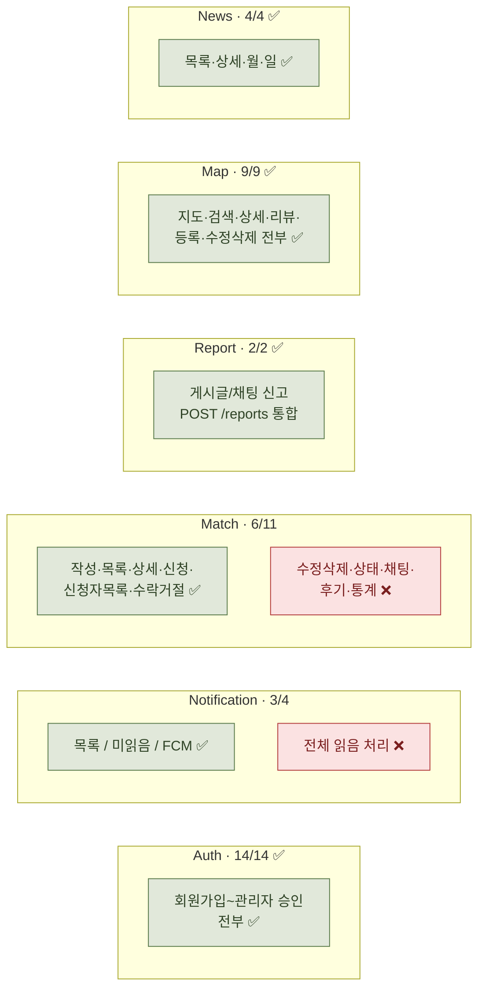
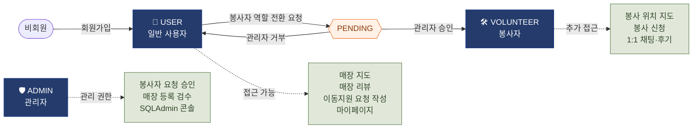
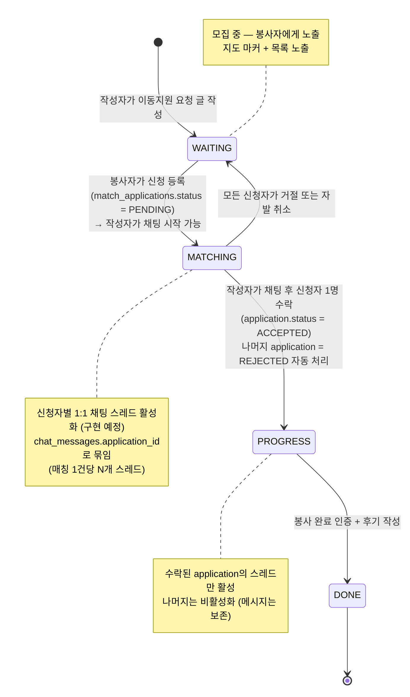
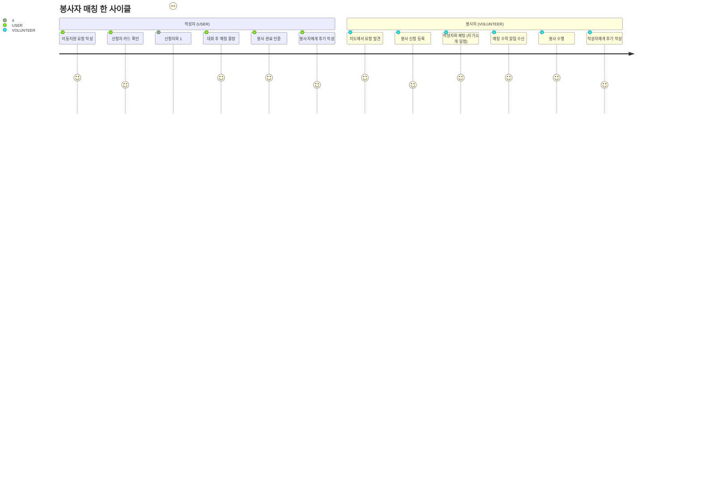
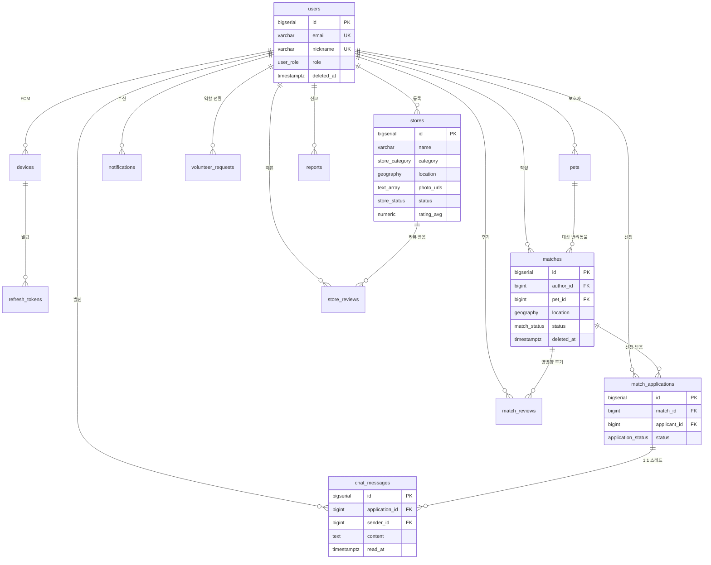

# 기능 다이어그램 — 시흥가개

> 마지막 갱신: 2026-05-02. 세부 명세는 `feature-spec.md`, `api-spec/*.md`, `db/db-design.md` 참고.

GitHub·VS Code·Notion 등 대부분의 마크다운 뷰어에서 mermaid 다이어그램이 그대로 렌더링된다.

---

## 1. 전체 기능 마인드맵

6개 도메인과 44개 기능 전체. **★** = T0 (MVP 필수), 표시 없음 = T1, 점 (·) = T2.

---

## 2. 구현 상태 매트릭스 (2026-05-02)

도메인별 진행률. T0(MVP 필수) 20개는 전부 완료. 미완 6건은 매칭 후속 + 알림 일괄 읽음.
구체적 엔드포인트는 `feature-spec.md` 표 참고.

---

## 3. 사용자 역할과 권한

3가지 역할(`USER` / `VOLUNTEER` / `ADMIN`)의 진입 경로와 접근 가능한 핵심 기능.

권한 의존성은 `app/core/deps.py` — `get_current_user` / `get_current_volunteer` / `get_current_admin`.

---

## 4. 매칭 라이프사이클 (State Diagram)

`matches.status` ENUM (`WAITING` / `MATCHING` / `PROGRESS` / `DONE`) 의 상태 전이.
매칭은 작성자(USER) ↔ 봉사자(VOLUNTEER) 양측의 액션으로 진행되며, **채팅은 신청 발생 직후부터** 작성자 ↔ 신청자 1:1로 가능하다 (수락 전 단계 포함).

> ⚠️ `MATCHING → PROGRESS` 까지는 `PATCH /matches/{id}/applications/{aid}` 로 구현되어 있으나, `PROGRESS → DONE` 전이(`PATCH /matches/{id}/status`)와 채팅·후기는 미구현이다.

---

## 5. 봉사자 매칭 시나리오 (User Journey)

"이동 지원 요청 → 채팅 → 봉사 매칭 → 완료" 시나리오 한 사이클.

---

## 6. 데이터 모델 ERD (요약본)

15개 테이블 중 핵심 관계만. 자세한 컬럼은 `db/db-design.md` 참고.

---

## 7. 우선순위 분포

| 우선순위 | 정의 | 개수 | 완료 |
| --- | --- | ---: | ---: |
| **T0** | MVP 필수 — 1차 시연 전까지 반드시 구현 | 20 | 20 ✅ |
| **T1** | 부가 기능 — 안정화 단계에서 구현 | 20 | 15 |
| **T2** | 확장 기능 — 시간 여유 시 구현 | 4 | 3 |
| 합계 | | **44** | **38** |

> 차단 관련 2개 기능(이전 마인드맵의 `·사용자 차단 등록`, `·차단 목록 조회 해제`)은 데모 범위에서 제외하면서 제거됐다.
